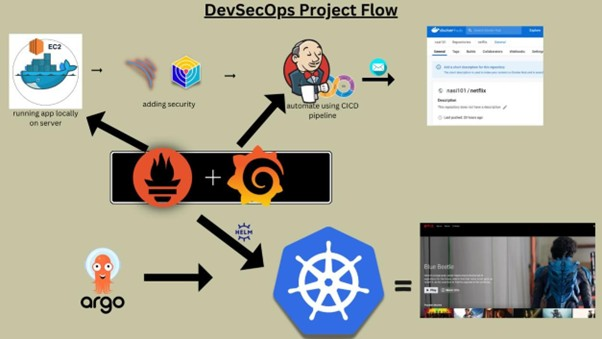

# Deploy-Netflix-Clone-on-Cloud-using-Jenkins
Embarking on an exciting DevSecOps journey, we're diving into the deployment of a Netflix  Clone on the cloud using Jenkins. This project encapsulates the fusion of development,  security, and operations practices, ensuring a streamlined and secure pipeline for delivering  software. 

### Project Architecture Review:
