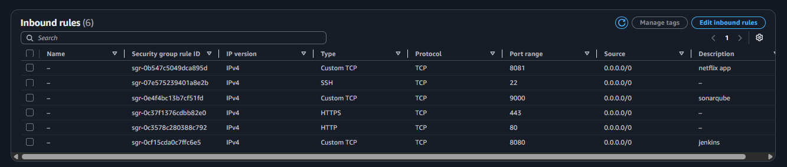
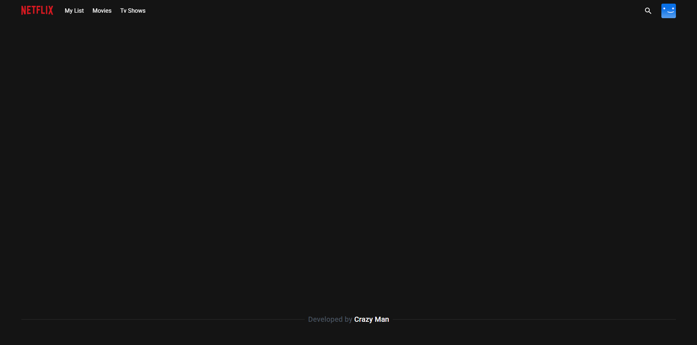
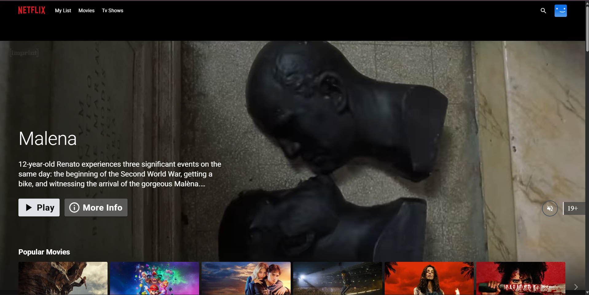

# Deploy-Netflix-Clone-on-Cloud-using-Jenkins
Embarking on an exciting DevSecOps journey, we're diving into the deployment of a Netflix  Clone on the cloud using Jenkins. This project encapsulates the fusion of development,  security, and operations practices, ensuring a streamlined and secure pipeline for delivering  software. 

### Project Architecture Review:


### **Phase 1: Initial Setup and Deployment**

**Step 1: Launch EC2 (Ubuntu 22.04):**

- Provision an EC2 instance on AWS with Ubuntu 22.04.
- Add t2-large
- Uses your defaut VPC and create a new SG that Allow SSH, HTTPS and HTTP for now 
- Add arrount 25 GiB of storage due to alot of different blocking we'are going to use. 
- Launche the EC2 instance
- Before connecting using SSH create and associate an Elastic IP to the new EC2 instance
- Connect to the instance using SSH by "EC2 Instance Connect" or "MobaXterm"
- If you have any error make sur the port 22 in your Security Group is open 

**Step 2: Clone the Code:**

- Update all the packages with the command below and then clone the code.
    ```bash
 
    sudo apt-get update
    ```
- Clone your application's code repository onto the EC2 instance:
    
    ```bash
    git clone https://github.com/Fokoue22/Deploy-Netflix-Clone-on-Cloud-using-Jenkins.git
    ```
- Verifie if the project is in your EC2 instance
    ```bash
 
    cd DevSecOps-NetflixProject/ 
    ls
    ``` 

**Step 3: Install Docker and Run the App Using a Container:**

- Set up Docker on the EC2 instance:
    
    ```bash
    
    sudo apt-get update
    sudo apt-get install docker.io -y
    sudo usermod -aG docker $USER  # Replace with your system's username, e.g., 'ubuntu'
    newgrp docker
    sudo chmod 777 /var/run/docker.sock
    ```
    
- Build and run your application using Docker containers:
    
    ```bash
    docker build -t netflix .
    docker images
    docker run -d --name netflix -p 8081:80 netflix:latest
    
    ```
- Open the application after running your docker container using your Public IPv4 address. 

    ```bash
   http://Public IPv4 address:8081/
    
    ```
- The website will only Open if you have port 8081 in your Security Group. So edit your inbound rules to have port ``8081`` , ``8080``, ``9000``



It will show but without any details cause you need API key


**Step 4: Get the API Key:**

- Open a web browser and navigate to TMDB (The Movie Database) website.
- Click on "Login" and create an account.
- Once logged in, go to your profile and select "Settings."
- Click on "API" from the left-side panel.
- Create a new API key by clicking "Create" and accepting the terms and conditions.
- Provide the required basic details and click "Submit."
- You will receive your TMDB API key.

Now recreate the Docker image with your api key. Before that stop/delete the running container:
```
# to delete
docker stop CONTAINER ID
docker rm CONTAINER ID
docker ps # to verifier if everything have been remove
```
```
# recreate the Docker with api key
docker build --build-arg TMDB_V3_API_KEY=<your-api-key> -t netflix .

# Build and run your application using Docker containers
docker images
docker run -d --name netflix -p 8081:80 netflix:latest
    
```




### **Phase 2: Security** 

1. **Install SonarQube and Trivy:**
- Install SonarQube and Trivy on the EC2 instance to scan for vulnerabilities.
        
**sonarqube**
        ```
        docker run -d --name sonar -p 9000:9000 sonarqube:lts-community
        ```
               
To access: publicIP:9000 (by default username & password is admin)
        
**To install Trivy:**
        ```
        sudo apt-get install wget apt-transport-https gnupg lsb-release
        wget -qO - https://aquasecurity.github.io/trivy-repo/deb/public.key | sudo apt-key add -
        echo deb https://aquasecurity.github.io/trivy-repo/deb $(lsb_release -sc) main | sudo tee -a /etc/apt/sources.list.d/trivy.list
        sudo apt-get update
        sudo apt-get install trivy        
        ```
        
to scan image using trivy
```
docker images
trivy image <imageid>
```
        
        
2. **Integrate SonarQube and Configure:**
    - Integrate SonarQube with your CI/CD pipeline.
    - Configure SonarQube to analyze code for quality and security issues.